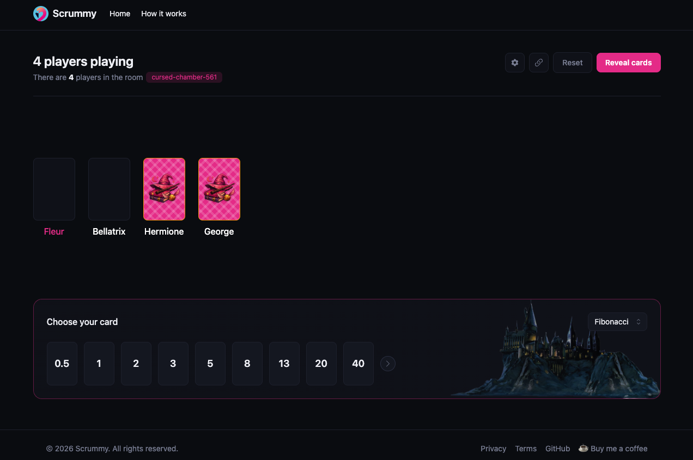

# Scrummy

Free, real-time planning poker for remote Scrum teams — no accounts, no
setup. Create a room, share the link, and estimate story points together.

**[scrummy.dev](https://scrummy.dev)**



## Features

- **Multiple scales** — Fibonacci, T-shirt sizes, Yes/No, and custom emoji
  reactions, switchable per room.
- **Pass, when you're not ready** — a standing option that's never counted
  in the average.
- **Live average & outliers** — see the average the moment cards are
  revealed, with a flag on votes far from the group.
- **Observer mode** — sit a round out without leaving the room.
- **Private rooms** — lock a room with a password.
- **Themed rooms & sound cues** — Harry Potter, Lord of the Rings, and Star
  Wars card art, with sound cues for joins, votes, and reveals.
- **No accounts** — just a nickname. Inactive rooms clean themselves up
  automatically after about a week.
- **Room moderation** — nudge someone who's gone quiet, or remove them if
  the room allows it.

## Tech stack

- [Vue 3](https://vuejs.org) + [Vite](https://vitejs.dev) + [Pinia](https://pinia.vuejs.org), styled with [Tailwind CSS v4](https://tailwindcss.com)
- [Cloudflare Workers](https://developers.cloudflare.com/workers/) serving the SPA, with a [Durable Object](https://developers.cloudflare.com/durable-objects/) per room coordinating live state over WebSockets
- TypeScript throughout, including a `shared/` package used by both the client and the Worker

## Getting started

```bash
npm install
npm run dev
```

This runs the Vite dev server and the Worker (including the room Durable
Object) together, so the whole app — SPA and WebSocket backend — works
locally at `http://localhost:5173`.

A [Makefile](Makefile) wraps the same npm scripts if you prefer
`make dev`, `make build`, `make typecheck`, etc.

### Environment variables

Copy `.env.example` to `.env` if you want your own [Google Analytics 4](https://analytics.google.com)
measurement ID:

```bash
cp .env.example .env
```

This is entirely optional — Scrummy runs fine with it unset, and falls
back to Cloudflare Web Analytics only (see the [privacy policy](src/views/Privacy.vue)
for what each collects and when).

### Deploying

```bash
npm run deploy
```

This builds the SPA and deploys it, along with the Worker, via
[Wrangler](https://developers.cloudflare.com/workers/wrangler/). You'll need
your own Cloudflare account and to update `wrangler.jsonc` (the `name` and,
once you have a domain, the commented-out `routes` entry) for your own
deployment. The included [deploy workflow](.github/workflows/deploy.yml)
does the same on every push to `master`, given `CLOUDFLARE_API_TOKEN` and
`CLOUDFLARE_ACCOUNT_ID` repo secrets (and, optionally, a
`VITE_GA_MEASUREMENT_ID` repo variable).

## Project structure

```
src/            Vue app — views, components, Pinia stores, router
worker/         Cloudflare Worker: HTTP routing + the Room Durable Object
shared/         Types and helpers used by both src/ and worker/
public/         Static assets (theme art, sounds, etc.)
```

## License

[MIT](LICENSE)
